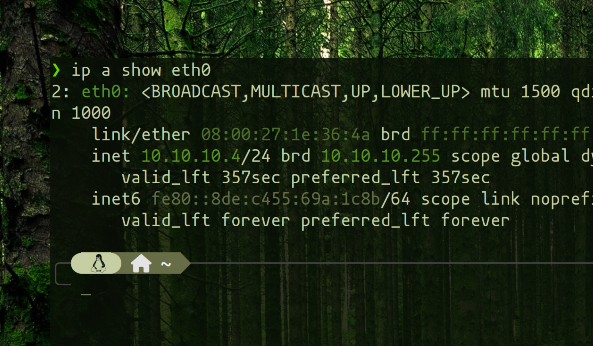

### Tools Used:

```
netcat whatweb nslookup nmap sherlock netdiscover dirb nikto angryipscanner whois
```

> Make sure that kali is updated before installing the tools mentioned below

-- -

### Tools that require manual installation:

- Install Angry IP Scanner for your operating system
    
    [Angry IP Scanner - Download for Windows, Mac or Linux](https://angryip.org/download/)
    
- Install sherlock in kali linux
    
    ```shell-session
    sudo apt install -y sherlock
    ```
    

-- -

### Lab Setup

> **Identify your Kali Machine’s IP Address!!!**, we use this IP to probe for alive hosts on the same subnet
> 
> 
> ```shell-session
> ip a show eth0
> ```
> 



Run the above command to identify your ipv4 address, mine is `10.10.10.4`, so I will be using this subnet (10.10.10.x) for scanning.

- My Metasploitable2 Machine is at: `10.10.10.10`

-- -

### Commands
- Dont go firing off these commands without understanding that `10.10.10.10` is for Metasploitable2 machine on **my setup!** Your scenario would be different!

- netcat - Used to Fingerprint Services
    
    ```
    nc 10.10.10.10 X # here x represents an open port (21, 22, 80, etc)
    ```
    
- whatweb - Identify Web Technologies
    
    ```
    whatweb 10.10.10.10 -v
    ```
    
- whois - Query Registrar Records
    
    ```
    whois microsoft.com
    ```
    
- nslookup - Lookup Name Server Routing
    
    ```
    nslookup google.com
    ```
    
- nmap - Powerful Network Mapper and Recon tool
    
    Utilize the `-T4` flag for increased scanning speed
    
    ```
    nmap 10.10.10.10 -T4
    ```
    
    ```
    nmap 10.10.10.10 -sV -T4
    ```
    
- sherlock - Social Presence Hunter
  > Only run this against an account that you own/ or have permission to! I used `hacker` as a reference, not to encourage you to repeat this.
    
    ```
    sherlock hacker
    ```
    
- netdiscover - Host Discovery Tool
    
    ```
    netdiscover -r 10.10.10.0/24
    ```
    
- dirb - Content Discover Tool
    
    ```
    dirb http://10.10.10.10/
    ```
    
- nikto - Web Recon Tool
    
    ```
    nikto -h http://10.10.10.10/
    ```
    
- Angry IP Scanner - Host Discovery Tool
It will automaticall fill up the IP range according to your eth0 interface, you just need to fire up the scan and wait for it to finish
